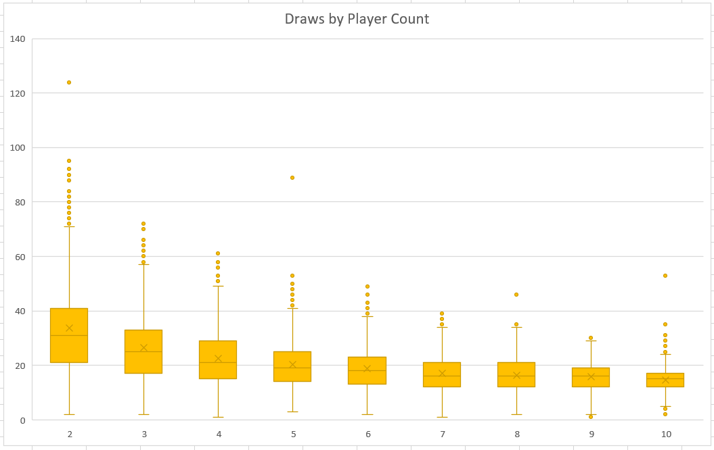
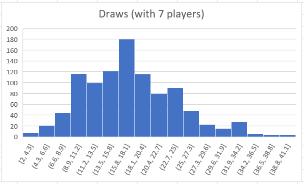
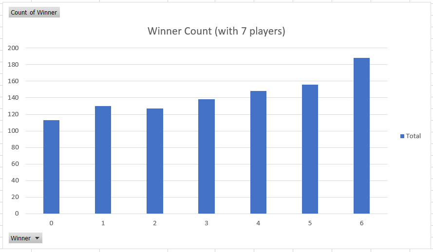
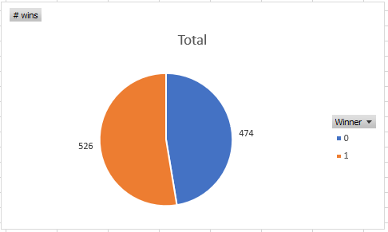

# Spoons Simulator

A simulator for a silly game so I can do statistics on it.

## Prerequisites:

* Python 3 (tested with 3.7.2)

## Background

Some of my friends enjoy a game called [Spoons](https://en.wikipedia.org/wiki/Spoons), in which players pass cards around until one player gets four of a kind in their hand, at which point the last person to grab a spoon from the center of the table is eliminated and the game re-starts. It's not a great game, but what interested me is that the card mechanic is simplistic and fairly mechanical and really only serves as an elaborate random timer which players must react to. 

Which made me curious: what are the characteristics of this timer? How long does it normally take for one player to get four of a kind? Does any player position have an unfair advantage? (even though the game is mostly about observation and reaction time, the player who draws four of a kind is essentially guaranteed to get a spoon and not be eliminated)

This simulator is written in Python because I've been trying to get more familiar with Python, and what better way than with a silly, simple, and unique project?

## How to run 

```python spoons.py```

This will create an `output.csv` file with data for a 1000 rounds per player count (that is, the results for 1000 rounds with 2 players, 1000 rounds with 3 players, and so on until 10 players, after which point there aren't enough cards in a standard deck to make the game work). This number is configurable with a constant.

## Results

I may return to this data when I get more familiar with the data science aspect of the Python ecosystem. For right now, I mostly just opened the CSV in Excel and built some charts.

These results assume players that all act exactly the same; their basic strategy is to take any card that gives them a bigger match than the card they would have to give up and pass any others. (which is about how I play the game, too)

### How long does a round normally take?

The game is somewhat asynchronous; all players are generally taking their "turns" at the same time as cards come to them. Because of that, the best way to measure the length of a round is to measure how many cards the dealer draws.



The game typically lasts around 15-25 draws, but is somewhat shorter the more players are involved. In the real world, though, this is probably offset by people being people and mixing up cards and taking too long to look at a card and generally doing silly human things that delay games.

With 7 players at least (and I assume this is true of other player counts), the distribution is fairly normal, but definitely noisy, even with a sample size of 1000 rounds:



### Does any player have an advantage?

Note that "winning" is used as a somewhat simplified term in this experiment to refer to the player that first got a match of four of a kind. The real game does not actually have a single "winner", only a loser that is eliminated before the next round. However, the player that gets the four of a kind match is almost guaranteed to be the first one to grab a spoon and thus is least likely to be eliminated.



With 7 players, the game definitely seems skewed towards players further from the dealer (player 0), with the 7th player in line (player 6, because yay 0-indexing!) almost 1.7x more likely to "win" than the dealer. That said, the dealer still has an ~11% chance of "winning".

This is, however, a concerning idea when it comes down to the final round with two players and one spoon. Barring an amazing quick-draw by the other player, the player who "wins" the card game almost certainly wins the game.



Indeed, it looks like the second player has a ~53% chance of winning. This is pretty close, though. Is it statistically significant, or is it just random chance?

...Well, to be honest, I have no idea how to calculate that. I'm a bit rusty on my statistics and getting too deep into that is outside my current goals of just learning Python better. (I'm already a bit too far into data analysis already!) _But_, combined with the clear pattern seen with 7 players, it probably is significant, but also very small.

## Summary

That was fun! I think I learned what I set out to learn, both about the game and about how to use Python for these sorts of things. Plus, I've now got a large dataset that I can use for future explorations into data science and maybe even machine learning.